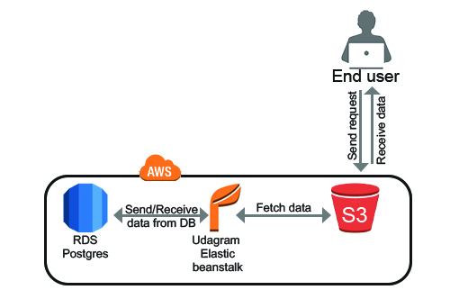
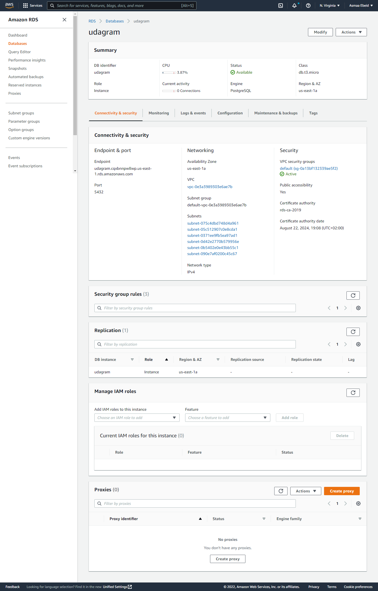
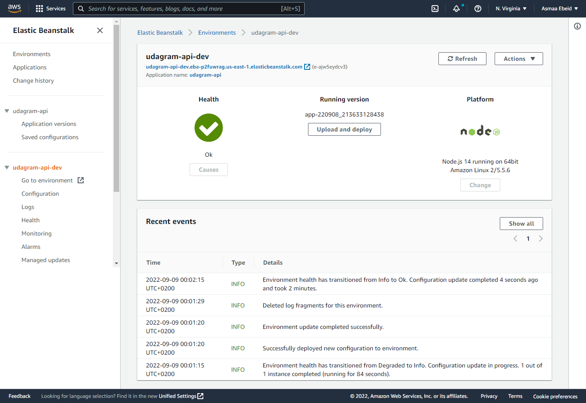
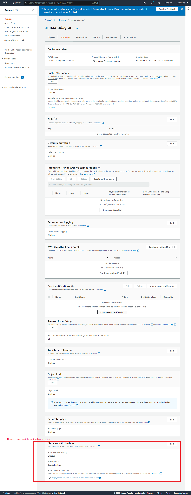

# Infrastructure description

## RDS Postgres

Using AWS RDS Postgres as application server database for storing and retrieving information.

Database endpoint: `udagram.cqxbnnpwllwp.us-east-1.rds.amazonaws.com`

## Elastic Beanstalk

Elastic Beanstalk extracts and runs the application on an endpoint this application has built and uploaded on s3 bucket.
EB URL: `udagram-api-dev.eba-p2fuwrag.us-east-1.elasticbeanstalk.com` 

## S3 Bucket

The frontend application is deployed using AWS S3 Bucket
Bucket URL: `http://asmaa-udagram.s3-website-us-east-1.amazonaws.com`
