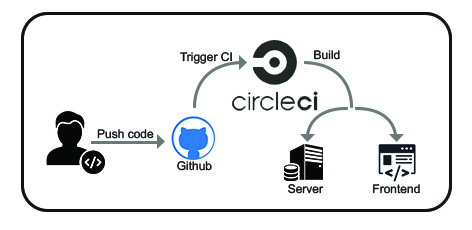
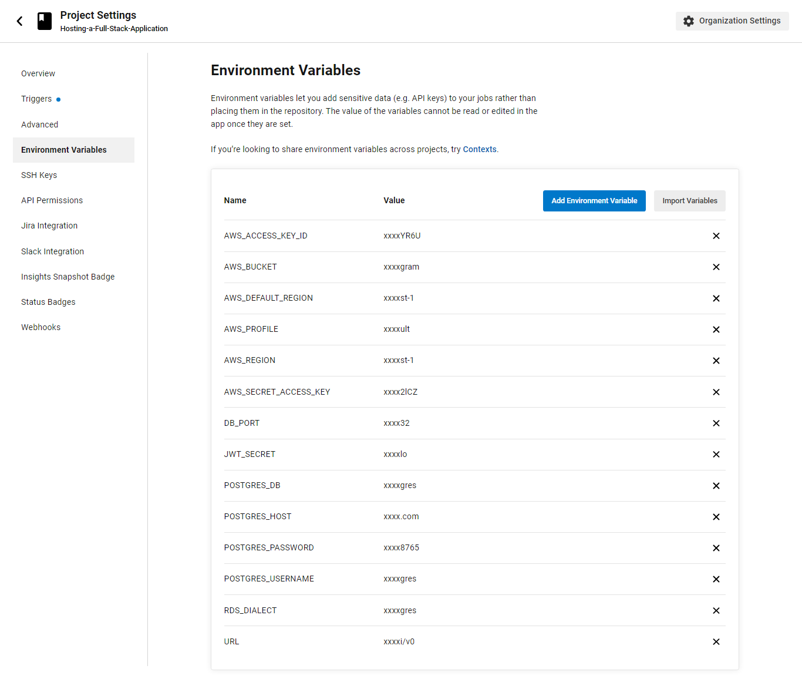
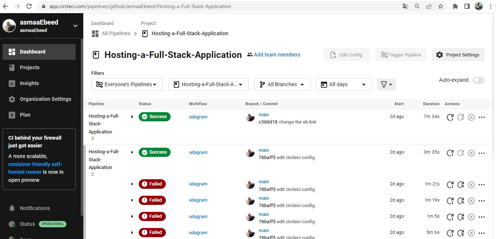

# Configuring Continuous Integration Pipeline with Github

Commit and push code to the GitHub repository which is linked to the CircleCI platform. GitHub triggers the CircleCI platform when code is pushed to the repository.

CircleCI configuration in  .circleci/config.yml file which tells the service what has to be done. In the case of Udagram, there are 2 jobs (frontend & server) to be run by CircleCI.

- ** FRONTEND ** :
    Run `npm run frontend:install` to install all frontend dependecies.
    Run `npm rum frontend:build` to build application.
    Then uses AWS CLI to upload assets to S3.
- ** BACKEND ** :
    Run `npm run api:install` to install all backend dependecies.
    Run `npm run api:build` to build app and export all environment variables from CircleCI configuration.
    

Here's screenshot of the last build shows that CircleCi account is authorized to access repo on Github and is detecting changes each time  pushing to the main branch.

